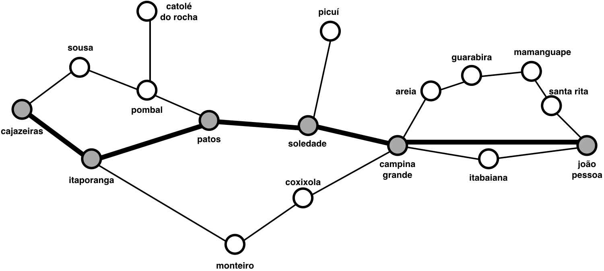
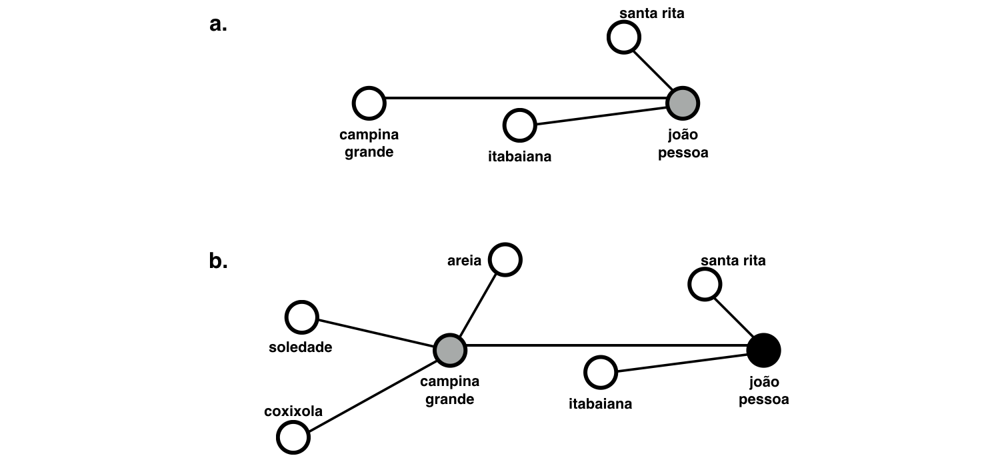
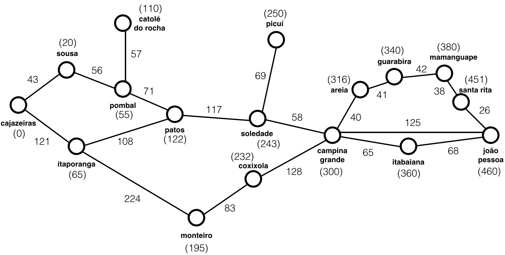

% Notas de Aula - Inteligência Artificial
% Yuri Malheiros
% UFPB - Campus IV - Rio Tinto

# Resolução de problemas

## 1. Introdução

Uma das formas mais simples de resolver um problema é executar uma sequência de passos para sair de um estado inicial, no qual o problema não está resolvido, até um objetivo, isto é, um estado no qual o problema está resolvido.

O processo de procurar uma solução de um problema através da exploração sistemática dos seus possíveis estados é chamado de **busca**. Como solução, a busca encontra uma sequência fixa de ações para sair do estado inicial e chegar no objetivo. É importante ressaltar, que nessa abordagem não existe um plano alternativo se algo der errado durante a execução da solução.

Este problema pode ser entendido como um problema de encontrar um caminho num grafo, que começa no estado inicial e termina no objetivo.

Para utilizar uma busca para resolver um problema, o ambiente que o agente inteligente está inserido deve ser: observável, discreto e determinístico.

A Figura 1 apresenta um mapa com algumas cidades do estado da Paraíba. Nele, uma busca pode ser usada para encontrar um caminho, por exemplo, da cidade João Pessoa até a cidade Cajazeiras, como é mostrado na Figura 2.

## 2. Formulando problemas

Um problema de busca pode ser definido por 6 componentes:

- Estado inicial: estado onde o agente começa;
- Ações(s): função que retorna as possíveis ações dado um estado *s*;
- Resultado(s, a): retorna o estado resultante da ação *a* a partir do estado *s*;
- Objetivo(s): testa se *s* é um objetivo ou não;
- Custo(s, a, s'): custo para executar a ação *a* a partir de *s* para chegar em *s'*;
- Objetivos: estados que solucionam o problema.

## 3. Busca genérica em grafo

Veremos mais a frente diversos tipos de buscas em grafos, entretanto todas essas buscas compartilham uma mesma base. Assim, primeiramente apresentaremos um algoritmo genérico de busca em grafo, que será transformado mais a frente em tipos específicos de busca.

A ideia do algoritmo de busca em grafo é sair do estado inicial para encontrar o objetivo explorando caminhos iterativamente. Usando o mapa da Figura 1, dado que seu estado inicial é a cidade João Pessoa, o algoritmo inicia verificando quais as ações possíveis a partir de João Pessoa. Nesse caso, o agente poderia ir para as cidades Santa Rita, Campina Grande ou Itabaiana (Figura 3a). Esses três estados formam um conjunto de estados que podem ser explorados a partir do estado atual, no algoritmo, ele recebe o nome de **borda** (ou fronteira). Uma decisão fundamental no algoritmo é a estratégia de escolha do estado da borda que será explorado, diferentes estratégias podem resultar em diferentes algoritmos de busca.

Continuando a exploração, se Campina Grande for escolhida, então o algoritmo retira Campina Grande da borda e adiciona os estados que podem ser alcançados a partir dela, fazendo com que a borda agora possua os nós: Santa Rita, Itabaiana, Areia, Soledade e Coxixola (Figura 3b). É importante perceber, que de Campina Grande também é possível chegar em Itabaiana, mas esse estado já estava na borda. Um algoritmo de busca em grafo descarta estados repetidos, então Itabaiana não deve ser adicionada à borda novamente.

Esse processo se repete até que o estado explorado seja um objetivo ou até que a borda seja vazia, nesse último caso, temos que não foi possível alcançar o objetivo.

O algoritmo a seguir implementa em Python a busca genérica em grafo:

~~~~ {#mycode .python .numberLines startFrom=""}
def generic_search():
    frontier = [initial_state]
    explored = set()

    while True:
        if len(frontier) == 0:
            return False

        new_state = choose_state(frontier)
        explored.add(new_state)

        if new_state in goals:
            return new_state

        for state in new_state.actions:
            if state not in explored or state not in frontier:
                frontier.append(state)
~~~~

Na linha 2, o algoritmo inicializa a borda com o estado inicial, em seguida, na linha 5, ele entre num loop até que atinja uma das condições de parada. Na linha 9 é feita a escolha de um estado na borda, a função *choose_state* deve ser implementada de acordo com a estratégia de escolha dos estados na borda. O for na linha 15 serve para adicionar à borda os estados que podem ser alcançados através das possíveis ações executadas em *new_state*. As linhas 3, 10 e 16 são responsáveis por evitar que estados redundantes sejam adicionados à borda. Na linha 3 um set que guardará os estados explorados é iniciado, na linha 10 o estado explorado é adicionado ao set e na linha 16 temos uma condição para que apenas um estado que não esteja no set ou não esteja na borda seja adicionado à borda.

Na implementação, é importante deixar clara a diferença entre os estados de um problema e os nós no grafo onde a busca é realizada. Até aqui, os conceitos foram utilizados sem distinção, mas, para implementar as buscas, precisamos deixar claro o papel de cada um.

Um estado corresponde a uma configuração de mundo, ou seja, a um estado do problema. Um nó é uma estrutura do grafo, que contém um estado, o custo para se chegar até esse estado e uma referência para o estado pai, isto é, o estado anterior no qual foi executado uma ação para se chegar ao estado do nó. Ao final da busca, as referências para o estado pai podem ser utilizadas para recuperar o caminho percorrido do estado inicial até o objetivo. Por fim, é importante saber que dois nós distintos, podem conter o mesmo estado, isso acontece quando caminhos diferentes no grafo levam a um mesmo estado.

## 4. Busca sem informações (busca cega)

Os primeiros algoritmos de busca que serão abordados são algoritmos de busca sem informações (ou busca cega). Estes algoritmos recebem tal nome, pois seus estados não possuem informação relacionada a sua qualidade em relação ao objetivo. Ou seja, ao escolher um estado, o algoritmo não tem ideia do custo desse estado até o objetivo. Por exemplo, num problema para encontrar um caminho entre duas cidades, não se tem a informação se uma cidade está mais próxima do objetivo do que outra.

A seguir veremos três tipos de buscas: busca em largura, busca de custo uniforme e busca em profundidade.

### 4.1. Busca em largura

A busca em largura é uma estratégia de busca simples, na qual o nó inicial é explorado, em seguida os sucessores do nó inicial são explorados, depois os sucessores desses nós, etc. Nesse caso, a estratégia de escolha de um nó na borda é simplesmente explorar o nó que foi adicionado primeiramente à borda, ou seja, a borda funciona como uma fila. Dada a árvore da Figura 4, a ordem de visitação dos nós aplicando a busca em largura com estado inicial A e objetivo G é: A, B, C, D, E, F e G.

O algoritmo de busca em largura é completo, isto é, ele sempre encontra a solução se ela existir. Além disso, ele é ótimo se os custos dos caminhos forem iguais.
As complexidades de tempo e espaço são as mesmas, $\mathcal{O}(b^d)$, onde $b$ é o número de sucessores de um nó e $d$ é a profundidade onde se encontra o objetivo. A complexidade exponencial é uma característica muito ruim desse tipo de busca. Num problema com $b=10$ e $d=2$, se cada nó for representado por 1kb, o algoritmo usará 100kb de memória, se aumentarmos d para 4, esse valor passa para 10mb, se dobrarmos d novamente, ou seja, tivermos um problema onde o objetivo se encontra no 8° nível de profundidade, o algoritmo usará cerca de 100gb!

### 4.2. Busca de custo uniforme

A busca de custo uniforme é uma extensão da busca em largura, que é ótima mesmo quando existirem caminhos com custos diferentes. Nela, ao invés de escolher o primeiro nó de uma fila que representa a borda, expande-se o nó com o menor custo de caminho ($g(s)$). Para isso, basta representar a borda como uma fila de prioridade, na qual o nó com menor $g(s)$ tem a maior prioridade. É importante observar que o custo de caminho $g(s)$, não é apenas o custo do *pai de s* até *s*, mas sim o custo do estado inicial até s.

Para implementação, existe uma modificação importante a ser feita no algoritmo de busca genérica apresentado anteriormente. Quando um nó já estiver na fronteira e o algoritmo tentar adicionar ele novamente, é necessário verificar se esse novo caminho para o nó tem um custo menor que o custo de caminho do nó na fronteira, se isso for verdade, o nó deve ser substituído.

No grafo da Figura 5, se for usada a busca de custo uniforme para sair de A até encontrar o objetivo E, os seguintes passos vão ocorrer. Primeiro explora-se o estado inicial A, com isso tem-se dois nós na borda: B e C. Como B tem o menor custo (10), então ele é escolhido, adicionando o nó D com custo 40 (10+30) à borda. O próximo nó explorado será C, que tem custo 20, assim o nó E será adicionado à borda com custo 120 (20+100). A seguir, o nó D é explorado e novamente tem-se o nó E para ser adicionado à borda. Nesse caso, o caminho para E tem custo 80 (10+30+40), que é menor que custo de chegar em E através de C (120). Assim, o algoritmo substitui o nó E na borda, pelo nó com o menor custo.

Dada a árvore da Figura 6, a ordem de visitação dos nós aplicando a busca de custo uniforme com estado inicial A e objetivo G é: A, B, C, F, D, G.

A busca de custo uniforme é completa. Ela também é ótima se todos os custos do problema forem não negativos. Assim como a busca em largura, a busca de custo uniforme possui complexidade de tempo e espaço exponenciais.

### 4.3. Busca em profundidade

Na busca em profundidade, a estratégia de escolha de um estado na borda é selecionar o último estado que foi adicionado. Assim, a borda nesse algoritmo pode ser representada por uma pilha. Dada a árvore da Figura 4, a ordem de visitação dos nós aplicando a busca em largura com estado inicial A e objetivo G é: A, B, D, E, C, F, G.

O algoritmo de busca em profundidade é completo, porém ele não é ótimo. Suponha que na Figura 4 o nó D seja um objetivo e C também. Nesse caso, a busca em profundidade retornaria D como solução, mesmo C sendo uma solução melhor. A complexidade temporal é $\mathcal{O}(b^m)$, onde m é a profundidade máxima. Já a complexidade espacial é $\mathcal{O}(bm)$, o que faz o uso de memória desse algoritmo ser muito menor que o da busca em largura e da busca em custo uniforme. Isso é possível, porque após um nó e todos os seus descendentes serem visitados, eles podem ser removidos da memória sem comprometer o funcionamento do algoritmo.

## 5. Busca informada (busca heurística)

Nas buscas apresentadas na seção anterior, ao explorar os estados de um problema, não era levado em consideração se ele estava mais perto ou mais longe da solução. Para resolver isso, a busca informada utiliza conhecimentos específicos do problema que está sendo resolvido. Nela, uma **função heurística** $h(n)$ é utilizada para ajudar a decidir que nós são mais promissores para a solução de um problema.

Esse tipo de busca é semelhante a busca de custo uniforme, mas com uma função de custo diferente, que vai utilizar a função heurística.

No geral, a busca informada pode encontrar soluções de forma mais eficiente que a busca sem informações.

A seguir veremos dois tipos de buscas: busca gulosa e busca A\*.

### 5.1. Busca gulosa

Na busca gulosa, também é usada uma fila de prioridade, como na busca de custo uniforme, para representar a borda. Entretanto, o custo utilizado é o custo avaliado pela função heurística ($h(s)$). Assim, o nó escolhido na borda será o nó com o menor valor de $h(s)$, isto é, o nó que mais se aproxima da solução.

A Figura 7, traz novamente o mapa com algumas cidades da Paraíba, mas dessa vez acrescido dos custos para ir de uma cidade para outra (os valores que aparecem nas arestas) e das distâncias em linha reta entre os estados e o objetivo que é a cidade de Cajazeiras (os valores entre parênteses próximos aos nomes das cidades). Nesse exemplo usaremos a distância em linha reta entre um estado e o objetivo como a função heurística.

Dado que o estado inicial é João Pessoa, a seguir tem-se uma lista das fronteiras e dos nós escolhidos em cada iteração do algoritmo:

~~~~{.email}
Iteração 1
Fronteira: [João Pessoa (460)]
Nó escolhido: João Pessoa

Iteração 2
Fronteira: [Santa Rita (451), Campina Grande (300), Itabaiana (360)]
Nó escolhido: Campina Grande

Iteração 3
Fronteira: [Santa Rita (451), Itabaiana (360), Areia (316),
            Soledade (243), Coxixola (232)]
Nó escolhido: Coxixola

Iteração 4
Fronteira: [Santa Rita (451), Itabaiana (360), Areia (316),
            Soledade (243), Monteiro (195)]
Nó escolhido: Monteiro

Iteração 5
Fronteira: [Santa Rita (451), Itabaiana (360), Areia (316),
            Soledade (243), Itaporanga (65)]
Nó escolhido: Itaporanga

Iteração 6
Fronteira: [Santa Rita (451), Itabaiana (360), Areia (316),
            Soledade (243), Patos(122), Cajazeiras (0)]
Nó escolhido: Cajazeiras

Solução: João Pessoa, Campina Grande, Coxixola, Monteiro,
         Itaporanga, Cajazeiras.
~~~~

A busca gulosa é completa, mas não é ótima. Note que no exemplo anterior, o caminho encontrado possui custo 701, entretanto o caminho João Pessoa, Campina Grande, Soledade, Patos, Pombal, Sousa, Cajazeiras tem custo 470. No pior caso, a complexidade de tempo e espaço é $\mathcal{O}(b^m)$, onde m é a profundidade máxima. No entanto, dependendo do problema e da função heurística utilizada, a complexidade é reduzida substancialmente.

### 5.2. Busca A\*

A busca A\* une os conceitos da busca gulosa e da busca de custo uniforme, assim, sua borda é uma fila de prioridade, na qual o custo associado a um estado é $f(s) = h(s) + g(s)$, onde $h(s)$ é a função heurística e $g(s)$ o custo de caminho.

Usando o exemplo da Figura 7 com estado inicial João Pessoa e objetivo Cajazeiras e mais uma vez com $h(s)$ sendo a distância em linha reta entre um estado e o objetivo, a seguir é mostrada uma lista das fronteiras e dos nós escolhidos em cada iteração do algoritmo:

~~~~{.email}
Iteração 1
Fronteira: [João Pessoa (460+0 = 460)]
Nó escolhido: João Pessoa

Iteração 2
Fronteira: [Santa Rita (451+26 = 477), Campina Grande (300+125 = 425),
            Itabaiana (360+68 = 428)]
Nó escolhido: Campina Grande

Iteração 3
Fronteira: [Santa Rita (451+26 = 477), Itabaiana (360+68 = 428),
            Areia (316+165 = 481), Soledade (243+183 = 426),
            Coxixola (232+253 = 485)]
Nó escolhido: Soledade

Iteração 4
Fronteira: [Santa Rita (451+26 = 477), Itabaiana (360+68 = 428),
            Areia (316+165 = 481), Coxixola (232+253 = 485),
            Picuí (250+252 = 502), Patos (122+300 = 422)]
Nó escolhido: Patos

Iteração 5
Fronteira: [Santa Rita (45)+26 = 477), Itabaiana (360+68 = 428),
            Areia (316+165 = 481), Coxixola (232+253 = 485),
            Picuí (250+252 = 502), Pombal (55+371 = 426),
            Itaporanga (65+408 = 473)]
Nó escolhido: Pombal

Iteração 6
Fronteira: [Santa Rita (451+26 = 477), Itabaiana (360+68 = 428),
            Areia (316+165 = 481), Coxixola (232+253 = 485),
            Picuí (250+252 = 502), Itaporanga (65+408 = 473),
            Sousa (20+427 = 447), Catolé do Rocha (110+428 = 538)]
Nó escolhido: Itabaiana

Iteração 7
Fronteira: [Santa Rita (451+26 = 477), Areia (316+165 = 481),
            Coxixola (232+253 = 485), Picuí (250+252 = 502),
            Itaporanga (65+408 = 473), Sousa (20+427 = 447),
            Catolé do Rocha (110+428 = 538)]
Nó escolhido: Sousa

Iteração 8
Fronteira: [Santa Rita (451+26 = 477), Areia (316+165 = 481),
            Coxixola (232+253 = 485), Picuí (250+252 = 502),
            Itaporanga (65+408 = 473), Catolé do Rocha (110+428 = 538),
            Cajazeiras (0+470 = 470)]
Nó escolhido: Cajazeiras

Solução: João Pessoa, Campina Grande, Soledade, Patos, Pombal,
         Sousa, Cajazeiras.
~~~~

Nesse algoritmo, é importante que a função heurística não superestime o custo de atingir o objetivo, isto é, $h(n) < custo real$. Tal característica é chamada de admissibilidade. Além disso, para o algoritmo ser ótimo, $h(n)$ precisa ser consistente, ou seja, $h(s)$ precisa ser menor ou igual que o custo de ir do estado *s* para o seu sucessor *s'* somado com h(s'). Matematicamente a consistência é definida como: $h(s) \leq custo(s, a, s') + h(s')$.

A busca A\* é completa e ótima se $h(n)$ for consistente, mas a sua complexidade continua sendo exponencial no pior caso como em outros algoritmos. Nessa busca, a memória ocupada é um problema bem maior que o tempo de execução, mas mesmo assim, uma boa função heurística ainda fornece uma grande vantagem em relação aos algoritmos de busca sem informações.

\  

## Referências

- Livro: Artificial Intelligence a Modern Approach (3a edição). Russel, S. e Norvig, P.
